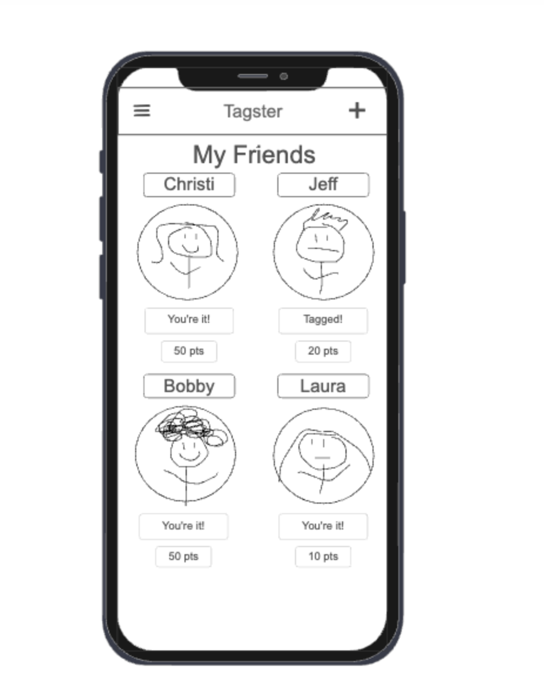
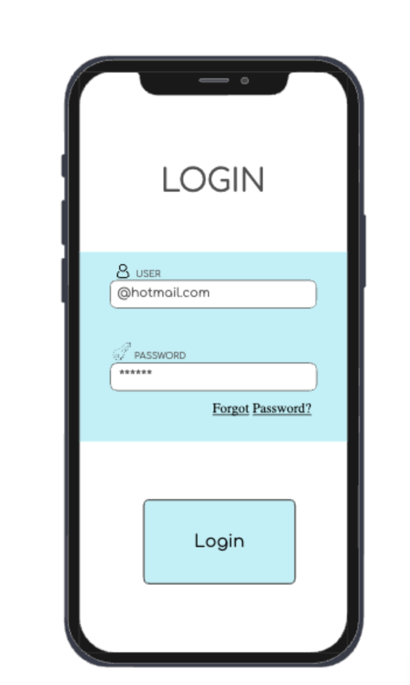

# Startup Application
## Elevator Pitch
Play online tag with your friends in Tagster! Tagster is a fun way to stay connected with your friends throughout the day. See your friend at the library, in the WILK, or walking to class? Jump into tagster and tag your friend to make them it! The longer that you're not it the more points you get. First one to reach the point limit wins bragging rights and becomes the ultimate tagster!

## Key Features
- Login Page
- Add and Remove Friends
- Tag Friends
- Points Tracker

## Technology
- HTML - Basic Page structure. Two HTML Pages one for login and one for home page.
- CSS - Style guide for use on different devices and uniform look.
- JavaScript - Homepage navigation.
- React - interactions with buttons to perform adding and tagging friends.
- Service - backend service for retrieving friends lists and tag state info.
- DB/Login - stores users login info, tags, and points.
- WebSocket - handles tags and updating other players tag states.

## Rough Draft UI Design

---

# HTML Deliverable
For this deliverable, I have laid out the basic format of my website

- 4 HTML Pages
- Navigation - can effectively navigate through all aspects of my application
- Authentication - placeholder created for login page
- Content - Placeholders created for friends as well as data supplied from a database such as users and tag scores
- WebSocket - Placeholder created to tag players and show wether a friend or the user is currently it.
- Images - Placeholder images included to represent friends

---

# CSS Deliverable
For this deliverable, I properly styled my application

- Properly styled header, footer, and body content in CSS
- Styled Nav Bar
- Styled Login, Tag, and Add friends buttons
- Friends grid that is responsive to window resizing
- Consistent and aesthetically pleasing fonts and colors
- stylized circular friends profile images

---

# React Deliverable
For this deliverable I have converted my site to React and have mimicked app functionality. App will only become functional with a database allowing player to player interaction.

- Bundled with Vite
- Login page with mimicking functionality
- Friends page with ability to add friends to homepage
- Router - routing between login, play, about, and add pages
- Hooks - uses UseState to manage an array of friends object with name, tag score, and whether they are "it"

# Service Deliverable

For this deliverable I created endpoints to pass users and friends to the backend. I also called APIs to give friends random profile pictures and a random dog picture on the about page

- Node.js/Express HTTP service - done
- Calls to third party endpoints - done
- Custom backend - stores friends and users
- frontend service calls backend - completed with fetch

# Database / Login Deliverable

In this deliverable my app is almost entirely functional there are some components that will work better with a socket connection, but they work with a page refresh

All data is stored and retrieved from my database including creation and authentication of users 

- MongoDB Atlas database created!
- Friends List, Scores, and Tag Status all stored in DB
- User registration and existing user authentication created!
- Functionality restricted to only authenticated users
